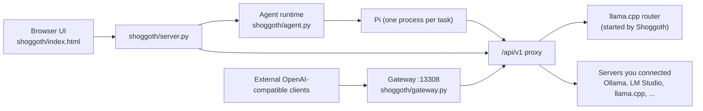

# Architecture

Shoggoth is a single-process Python service (standard library only) that serves one HTML page, supervises inference engines, and hosts an agent runtime. It has no third-party Python dependencies.

## Components

```mermaid
flowchart LR
    ui["Browser UI<br/>shoggoth/index.html"] --> srv["shoggoth/server.py"]
    ext["External OpenAI-compatible clients"] --> gw["Gateway :13308<br/>shoggoth/gateway.py"]
    srv --> agent["Agent runtime<br/>shoggoth/agent.py"]
    agent --> pi["Pi (one process per task)"]
    pi --> proxy["/api/v1 proxy"]
    srv --> proxy
    gw --> proxy
    proxy --> lcpp["llama.cpp router<br/>(started by Shoggoth)"]
    proxy --> srv2["Servers you connected<br/>Ollama, LM Studio, llama.cpp, ..."]
```

| Component | Responsibility |
| --- | --- |
| `shoggoth/server.py` | HTTP server, UI authentication, routing, lifecycle (including the idle watchdog). |
| `shoggoth/index.html` | The entire front end, in one file. Fonts and Mermaid are served from `shoggoth/vendor`. |
| `shoggoth/gateway.py` | The second listener for external clients (default port 13308), and the request recorder behind the Server page. |
| `shoggoth/agent.py` | Runs Pi and the job loop. See [AGENT-RUNTIME.md](AGENT-RUNTIME.md). |
| `shoggoth/providers/`, `provbase.py`, `registry.py` | Engine abstraction. See [ENGINES.md](ENGINES.md). |
| `shoggoth/llamacpp.py`, `servers.py`, `scan.py` | Shoggoth's own llama.cpp (download, start, router), the servers a person connected, and finding running ones. |
| `shoggoth/hardware.py`, `gguf.py`, `modelmeta.py` | Device discovery and telemetry, GGUF header parsing, and the memory-fit estimate. |
| `shoggoth/library.py`, `modelscan.py`, `hf.py` | The unified model library, import from other tools' folders, and Hugging Face file listings. |
| `shoggoth/llamatune.py`, `tuning.py` | Model tuning for llama.cpp models, measured with `llama-bench`. |
| `shoggoth/skills.py`, `workcopy.py`, `folders.py`, `websearch.py` | Skills, work copies, per-folder trust, and the web search tool. |
| `shoggoth/piup.py`, `zestup.py` | Updates for Pi and for Shoggoth itself. |

## Request flow

All model traffic passes through one forwarding function. It streams the upstream response unmodified and classifies each chunk as waiting, thinking (`reasoning_content`, or text inside `<think>` tags), or writing. The Server page and the per-reply speed figure are derived from that classification.

- The UI's chat and Pi both call `/api/v1`, an authenticated proxy inside the UI server. Their requests are recorded alongside external ones.
- External clients call the gateway. It exposes only the OpenAI-style endpoints (models, chat, completions, embeddings, responses, audio, images, reranking, and model load and unload), always requires the API key, and listens on loopback unless LAN access is enabled.
- `/api/*` serves only those same OpenAI-style endpoints (plus Google's own format for Gemini); nothing else is forwarded.

## Engine integration

Each engine is a provider (`provider.yaml`, optionally `provider.py`). The registry selects the provider that can run a model, stops what Shoggoth started in any conflicting memory group, starts the target, and routes requests to its endpoint.

**llama.cpp.** Shoggoth downloads llama.cpp's official Linux build for the graphics card (checked against the checksum GitHub publishes) and runs `llama-server` in router mode: one process on 127.0.0.1 with its own key, `--models-dir <data>/views/llamacpp`, `--models-preset <data>/llamacpp/presets.ini` and `--models-max` from the "keep up to N models loaded" setting. The router starts one process per loaded model. The models folder holds only links: `library.sync_views` links every library file routed to llama.cpp (a split or vision model as a folder of links), and `migrate5.py` links what a 4.x Lemonade downloaded. A router left running by a previous Shoggoth is adopted (`llamacpp/run.json`). The AppImage carries the processor-only build so the first run works offline.

**Hugging Face downloads** go straight into the library folder (`hf.py`), verified against the file's sha256.

**Connected servers.** A server the person runs (Ollama, LM Studio, llama.cpp, Strata, Maya, Unsloth, or any OpenAI-style server) is saved by address under Advanced > Engines and becomes an address-only engine. Shoggoth reads its model list and sends requests to it. It never installs, starts, stops, updates or tunes it.

## Hardware discovery

- Device lists come from the llama.cpp binary itself, not from enumeration. llama.cpp orders devices differently from `nvidia-smi` (CUDA places the fastest device first), so querying it keeps names and indices consistent. Devices therefore appear only after a backend is installed.
- Live telemetry is read from `nvidia-smi` (NVIDIA) and from sysfs for the `amdgpu` driver (AMD): memory used and total, load, temperature, power, fan, and the processes holding memory. Process names only; full paths are not collected.
- The engine log is llama.cpp's own (`<data>/llamacpp/llama-server.log`), which also holds what each model's process printed.

## Platform support and known limitations

- **Supported OS:** Linux x86_64 with glibc 2.38 or newer (Ubuntu 24.04, Debian 13, Fedora 39 or Linux Mint 22 and later): llama.cpp's official builds need it, and the router can't run through a bundled loader because it starts each model's process from its own executable.
- **Tested hardware:** NVIDIA GPUs. The Vulkan and ROCm builds have not been exercised on real hardware.
- **AMD telemetry** has been verified only against a simulated amdgpu sysfs tree and a screenshot from a two-Radeon VII system. Two identical AMD devices are matched to llama.cpp devices by order, so their usage may be reported swapped.
- **Intel devices** are listed and selectable, but report capacity without live usage. The fit estimate treats them as idle.
- **Gated Hugging Face models** (those requiring a login) are not supported.
